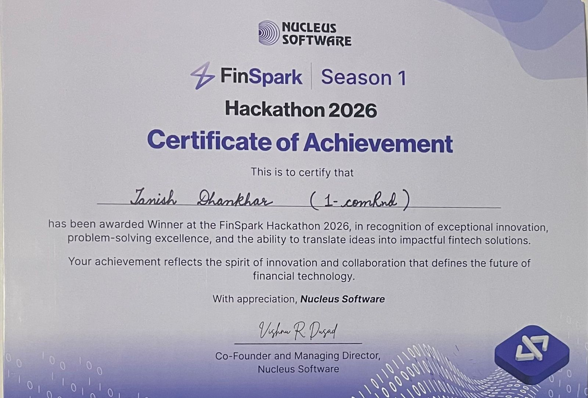
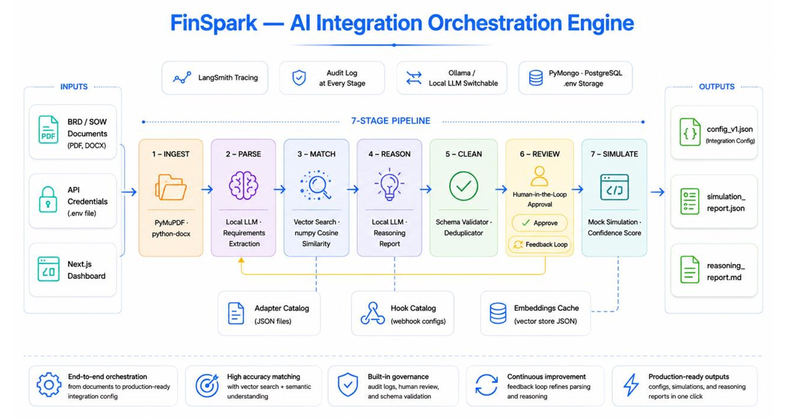

# FinSpark — AI Integration Orchestration Engine

## 🏆 1st Place Winner — FinSpark PS2 · Nucleus Software Hackathon 2026



> **Team 1-comeRnd · Nucleus Software Hackathon 2026 · Problem Statement 2**

Transform business requirement documents into production-ready integration configurations — zero manual schema mapping, zero hardcoded credentials, full audit trail.

---

## The Problem — The $2B Integration Bottleneck

Enterprise lending platforms integrate with 10–20+ external services: credit bureaus, KYC providers, GST engines, fraud systems, payment gateways, and open banking APIs. Pre-built adapters exist, but customer-specific configuration is still **100% manual**.

Today, implementation teams:
1. Read 100-page BRDs and SOW documents by hand
2. Perform repetitive field-by-field schema mapping
3. Select API versions manually (often picking deprecated ones)
4. Configure lifecycle hooks and transformation rules from scratch
5. Run weeks of sandbox testing cycles before a single client goes live

The result: **4–8 weeks onboarding per client, 30–40% defect rate from human error, no audit trails, no version governance.**

> The adapters are ready. **The configuration process is broken.**

---

## Our Approach — What If Configuration Could Configure Itself?

We built a **7-stage AI orchestration pipeline** that reads a BRD and produces a production-ready integration config in minutes — with full reasoning, human oversight, and a tamper-evident audit trail baked in.

One document in. Production-ready config out.

| Metric | Before (Manual) | After (FinSpark) |
|---|---|---|
| **Onboarding Time** | 4–8 weeks | Under 10 minutes |
| **Defect Rate** | 30–40% | Near-zero (simulation-validated) |
| **Document Analysis** | Engineers read manually | AI extracts every signal in seconds |
| **API Version Handling** | Manual lookup, deprecated versions slip through | Auto-detected, upgraded, enforced |
| **Config Review** | Emails and spreadsheets | In-app human review with AI reasoning |
| **Audit Trail** | Nonexistent | Full SHA-256 hashed, tamper-evident log |
| **Adapter Matching at Scale** | Impossible beyond 20 adapters | Semantic vector search — works at 500+ |

---

## The 7-Stage AI Pipeline



```
Upload BRD → [1] Ingest → [2] Parse → [3] Match → [4] Reason → [5] Clean → [6] Review → [7] Simulate → Production-Ready ✓
```

### Stage 1 — Document Ingestion
- Supports PDF, DOCX, TXT, and MD files
- PDF: page-by-page extraction via PyMuPDF; DOCX: paragraphs + tables with full hierarchy preserved
- **Zero AI — pure deterministic code.** No hallucinations at ingestion.
- Audit event logged: document count + character count

### Stage 2 — Requirement Parsing
- LLM reads the BRD and extracts **every integration signal**: service name, provider, category, mandatory/optional role, version hints, all input/output fields, compliance requirements, and hook signals
- Handles named APIs ("TransUnion CIBIL"), vague descriptions ("a credit API"), and uncatalogued APIs — all extracted and flagged
- BRD text cap: 12,000 characters to fit local model context window safely
- Deterministic role filter runs after LLM: demotes zero-field services to `mentioned_only`

### Stage 3 — RAG Adapter Matching & Config Enrichment
**Match:**
- RAG vector search: query embedded → cosine similarity against all adapter embeddings → Top-3 candidates
- LLM selects best adapter — exact name match first, then semantic score
- Score < 0.45 → `low_confidence` flag raised for reviewer

**Enrich:**
- Full adapter JSON loaded (endpoints, auth, field schemas, retry policy, versions)
- LLM fills one integration at a time — no context sharing between services
- Deprecation flag + sunset date enforced by Python — never left to LLM judgment

**Hooks:**
- Hook vector search → Top-5 candidates per integration
- Mandatory hooks always assigned: `credential_resolve_hook`, `pre_auth_hook`, `retry_hook`, `on_failure_alert_hook`
- PII fields (PAN, Aadhaar, phone) → `field_encryption_hook` auto-added
- Compliance requirements → `audit_emit_hook` auto-added

> Works identically at 12 adapters or 500+ — LLM never sees the full catalog.

### Stage 4 — Reasoning Report
- AI generates a comprehensive markdown report explaining **every pipeline decision**
- Sections: adapter selection rationale, version selection + deprecation notices, missing required fields (table), unmatched APIs, field mapping summary, overall confidence assessment
- Shown to reviewer alongside config — **no black box**

### Stage 5 — Production Cleaner
- Strips all internal pipeline annotations (`_brd_*` keys, `_adapter_reason`, staging markers)
- Scans for accidentally hardcoded credentials → replaces with `$ENV_VAR` references
- **Programmatic post-sweep runs after LLM** — guarantees no annotation keys survive
- Auto-restores any integrations or hooks the LLM accidentally dropped

### Stage 6 — Human-in-the-Loop Review
- Pipeline physically **pauses** — config + reasoning report shown to reviewer in full
- Three actions:
  - ✅ **Approve** → triggers Stage 7 simulation
  - ✏️ **Request Changes** → plain-English correction applied by LLM, new config version saved
  - ⚠️ **Escalate** → after 3 iterations, auto-escalated, never auto-approved
- Every correction creates a new version — previous versions permanently preserved

### Stage 7 — Simulation & Testing
- Each integration tested against mock API responses across 6 fault scenarios
- **Confidence score formula:**
  - `base_score = (mapped_fields / total_fields) × 100`
  - `missing_penalty = missing_count × 15`
  - `confidence_score = max(0, base_score − missing_penalty)`
- Status: `passed` (≥75, 0 missing) / `warning` (≥50) / `failed`
- Config marked `"production-ready"` **only after simulation passes**

> Every stage is traceable. Every decision is explainable. No black boxes.

---

## Semantic RAG — The Engine Behind Adapter Matching

The adapter catalog contains 12 adapters across 8 categories. Instead of feeding the entire catalog to the LLM (which doesn't scale), we use a **Retrieval-Augmented Generation** approach:

1. **Build Search Query** — From BRD extraction: purpose + provider + exact API name + category + compliance context. Deliberately excludes field names — `pan_number` appears in 8 adapters and would dilute the intent signal.
2. **Embed + Search** — Query embedded via `nomic-embed-text` (768-dim). Cosine similarity against all pre-built adapter embeddings. Returns **Top-3 candidates** in milliseconds.
3. **LLM Selects Best** — Exact name match → category alignment → semantic score. LLM never invents adapter IDs — only uses IDs from the candidates list.
4. **Full Context Fill** — Full adapter JSON loaded. LLM fills one integration at a time.

**Adapter Catalog (12 Adapters):**

| Category | Adapters |
|---|---|
| Bureau | TransUnion CIBIL, Experian |
| KYC | Karza KYC, DigiLocker |
| Banking | Penny Drop, Perfios Aggregator |
| Payment | Razorpay, Stripe |
| GST | GSTN API |
| Fraud | RiskGuard Analytics |
| Messaging | Twilio SMS |
| Health | Aarogya Health API |

**13 Lifecycle Hooks:**
`credential_resolve_hook` • `pre_auth_hook` • `retry_hook` • `on_failure_alert_hook` • `audit_emit_hook` • `field_encryption_hook` • `post_schema_validation_hook` • `post_transform_hook` • `pre_validation_hook` • `rate_limit_guard_hook` • `logging_hook` • `simulation_intercept_hook` • `version_compatibility_hook`

> Vector search pre-filters — LLM never sees the full catalog. Scales to 500+ adapters with zero architecture change.

---

## Core Differentiators

**Human-in-the-Loop by Design**
Pipeline pauses for mandatory human review. Reviewers approve or request natural-language corrections. Max 3 iterations — nothing auto-approves.

**Template-Driven Config, Not Freeform AI Output**
Every config follows a standardized schema (`config_v1_template.json`). AI fills the template — it doesn't invent the structure.

**Explainable AI with Full Reasoning Report**
The system generates detailed reports explaining adapter selection, version choices, field mapping decisions, missing fields, and confidence levels — before a human approves anything.

**Full Audit Trail with Config Diff History**
Every change is timestamped, SHA-256 hashed, and traceable. Structured diffs show exactly what changed between any two config versions.

---

## Enterprise Security & Multi-Tenancy

4-layer defense ensuring complete physical isolation between clients:

| Layer | Mechanism |
|---|---|
| **1 — Input Validation** | Strict regex on client IDs (`^client_[a-f0-9]{8}$`), filename allowlist, extension whitelist, traversal detection |
| **2 — Project Ownership** | Every API request verifies project exists in DB before proceeding |
| **3 — Path Confinement** | All file operations resolved and checked to stay inside `clients/{client_id}/`. Traversal attacks caught before disk access. |
| **4 — PostgreSQL RLS** | Every runtime query sets `SET LOCAL app.current_client_id`. Cross-client data is invisible even if app code has a bug. |

**Credential Policy:** API keys stored in `credentials` table, never in config JSON files. Configs reference keys as `$CIBIL_API_KEY` — never the actual value. Stage 5 programmatic sweep catches any accidental hardcoded values.

> Cross-tenant data leakage is physically impossible — enforced at the database engine level.

---

## Additional Features

| Feature | Description |
|---|---|
| **Upload and Re-Run** | Upload revised documents → new config version → full pipeline re-run. Full version history preserved. |
| **Config Diff Viewer** | Structured diffs between any two config versions — amber for changed, green for added, red for removed. |
| **In-Dashboard Config Editor** | Edit config JSON directly in the browser. Every save is SHA-256 hashed and audited. |
| **Version Migration** | One-click upgrade any integration to a newer API version. Rollback always available. |
| **Intelligent Deprecation** | Auto-upgrades deprecated API versions from BRD to latest stable; reasons logged in the reasoning report. |
| **Batch Processing** | Multiple client pipelines run simultaneously, each in its own isolated workspace. |

---

## Local Model Architecture

FinSpark runs **100% locally** — no cloud API keys required. All inference and embedding is served via **LM Studio** on your machine:

| Role | Model | Endpoint |
|---|---|---|
| **Generation (LLM)** | `qwen2.5-coder-7b-instruct` | `http://127.0.0.1:1234/v1` |
| **Embeddings** | `text-embedding-nomic-embed-text-v1.5` | `http://127.0.0.1:1234/v1` |

Both are served through LM Studio's **OpenAI-compatible API**, so a single `openai` Python client handles generation and embeddings with zero additional dependencies.

**Why local models?**
- Air-gapped deployment — no data leaves the machine
- No API keys, no rate limits, no per-token costs
- Full control over model updates and versioning
- Embedding cache auto-rebuilds when model changes (detected via `_meta.model` comparison)

---

## Tech Stack

| Layer | Technology | Purpose |
|---|---|---|
| **Backend** | Python, FastAPI, Uvicorn | Async REST API — 20+ endpoints, background pipeline tasks |
| **AI / LLM** | Qwen2.5-Coder-7B-Instruct (via LM Studio) | Parsing, matching, cleaning, correction, simulation |
| **AI / Embeddings** | nomic-embed-text v1.5 (768-dim, via LM Studio) | Semantic adapter + hook search |
| **Document Parsing** | PyMuPDF, python-docx | PDF page extraction, DOCX paragraphs + tables |
| **Frontend** | Next.js 16, React 19, TypeScript, Tailwind CSS 4 | 7-tab dashboard, real-time pipeline polling, confidence gauge |
| **Config Diffing** | DeepDiff 7.0 | Structural JSON comparison between config versions |
| **Validation** | Pydantic 2.6 | Request/response validation |
| **Vector Search** | NumPy (in-process) | Cosine similarity — no external vector DB required |
| **Database** | PostgreSQL 15+, psycopg2 | 7 tables, Row-Level Security, multi-tenant |
| **Config Storage** | JSONB in PostgreSQL | Versioned configs, structured storage |
| **Security** | Regex + Path Confinement + RLS | 4-layer enterprise defense |
| **Local Inference** | LM Studio | OpenAI-compatible local model server |

---

## Business Impact

| Metric | Before | After | Delta |
|---|---|---|---|
| Onboarding Time | 4–8 weeks | 10–30 min | **~95% reduction** |
| Engineer Hours per Client | 80–160 hrs | 1–2 hrs (review only) | **~97% reduction** |
| Integration Defect Rate | 30–40% | <5% | **~90% reduction** |
| Deprecated API Detection | Caught in QA (weeks later) | Caught at config generation | **Pre-production** |
| Audit Coverage | 0% | 100% | **Full coverage** |
| Adapter Matching at Scale | Fails beyond 20 adapters | Works at 500+ | **Unlimited** |

**Financial impact estimate:** 20 new client integrations/year × 160 engineer-hours = 3,200 hrs. At ₹8,000/hr → ₹2.56 Cr/year just for config work. FinSpark reduces that to ~40 hrs/year. **Potential saving: ₹2.5+ Cr/year per enterprise customer.**

---

## Future Roadmap

- 🔬 **Fine-tuned AI Model** — Specialized model trained on enterprise BRDs for faster, cheaper, more accurate parsing
- 📦 **Expanded Adapter Library (500+)** — Grow from 12 to 500+ adapters, open-source contributions welcome
- 🧪 **Real Sandbox API Testing** — Replace mock responses with live sandbox environments
- 🧠 **Learning from Corrections** — System improves over time from human feedback
- 🔐 **OAuth 2.0 + RBAC** — Production-grade authentication
- 🌐 **Public Adapter Marketplace** — Platform for developers to build, publish, and share custom adapters
- 📊 **Analytics Dashboard** — Aggregate metrics: onboarding velocity, most-used adapters, average confidence scores

---

*FinSpark · AI Integration Orchestration Engine · FinSpark PS2 · Nucleus Software Hackathon 2026 · Team 1-comeRnd*